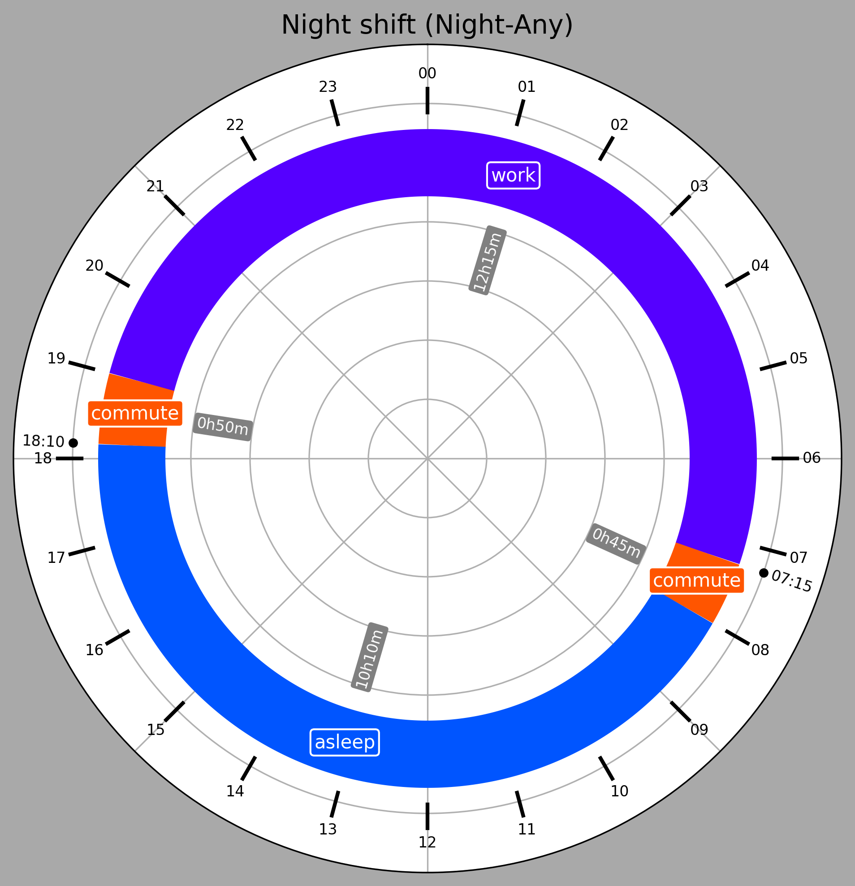
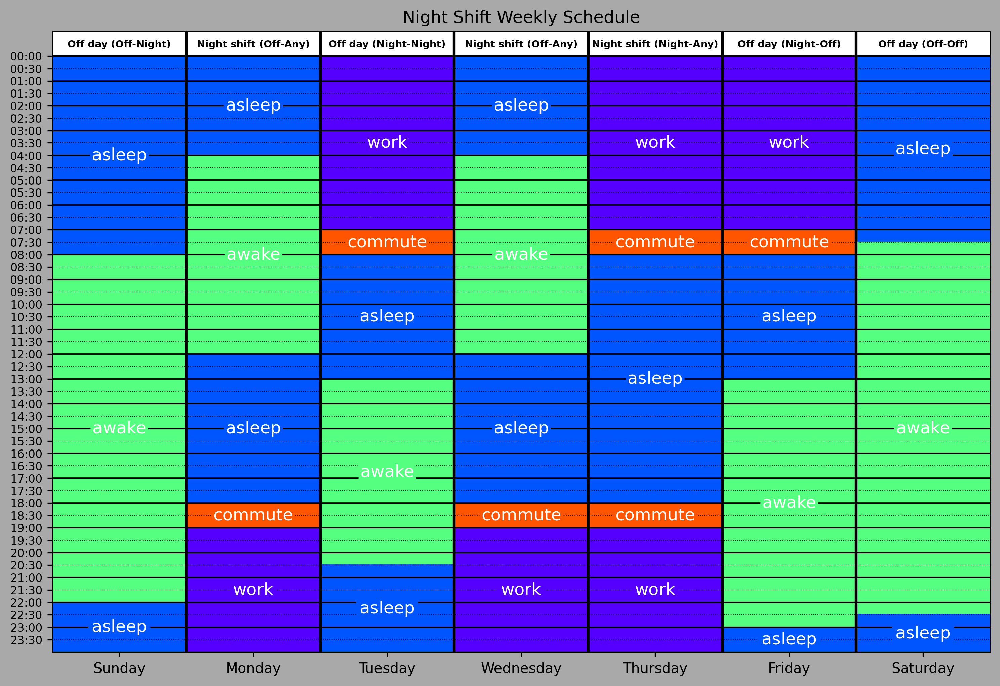

# Night Shift Schedule Helper
This Python application uses two types of schedule organizations to help night shift workers visualize their planned schedules, both for their benefit and for the benefit of their friends and loved ones.

## Clock Schedule
The first plot type is a "Circular Time Chart" or (more fun) a "Clock Plot". It is a round, 24-hour polar plot with the time axis wrapped around. The user defines activity segments of the day to make up the circle, as seen in the example below:

    

  

## Sheet Schedule
The second plot type is a spreadsheet-style plot. Instead of graphing one day, like the clock plot, the Sheet Schedule spans one week, showing all 24 hours side-by-side to make trends easier to visualize. For example:

    

  

## Installation
> [!Warning] This project was developed and works on Python 3.13. I am not sure what minor of Python 3 will break it, but most likely you need at least 3.8 or 3.10.
1. Download the .zip of this project and extract it (the green `Code` button)
2. Open a terminal in the extracted directory
3. `pip install -r requirements.txt`

## Usage
Once you have the dependencies installed (see Installation), adjust the [`config.json`](config.json) to your liking. [`config.json`](config.json) and [`example-config.json`](example_config.json) are the same out-of-the box: this is intentional. This way, you have a starting point to work from in your personalized schedule, and you can always load [`example-config.json`](example-config.json) in the GUI if you ever need to look back. If you want to start from scratch, use the [`template.json`](template.json).

> [!tip]
> Run the GUI: `python gui.py`

Each of the individual schedulers can be run, though they use [`example-config.json`](example_config.json) by default. To change this, just edit the file path in the last section of the code.

> [!tip]
> Run Scheduler Sheet: `python scheduler_sheet.py`
> 
> Run Scheduler Clock Plot: `python scheduler_clock_plot.py`

## Story
__TODO__

 ## TODOs
- [ ] Meals
- [ ] Reduce `requirements.txt`
- [ ] Short file path
- [ ] Readme story
- [X] Update example files
- [X] Config file folder
- [X] Config customization
- [X] Fix double plot preview
- [X] Fix config file problem
- [X] Expand readme
- [X] Fix clock plot colors
- [X] Rename this repo to more accurately reflect what this is
- [X] GUI layout alignment
- [X] Add config file picker to GUI
- [X] Fix empty time slot problems
- [x] Make a GUI
