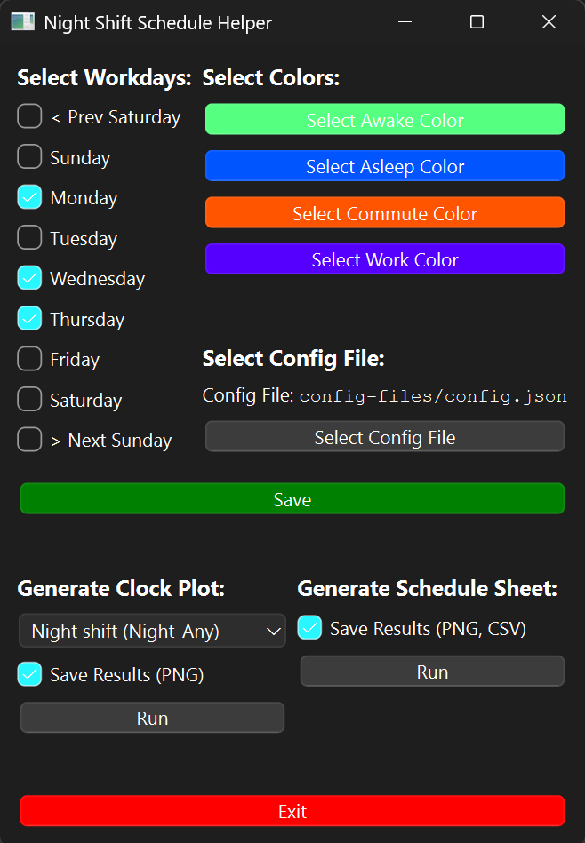

# Night Shift Schedule Helper
This Python application uses two types of schedule organizations to help night shift workers visualize their planned schedules, both for their benefit and for the benefit of their friends and loved ones.

    

 

## Clock Schedule
The first plot type is a "Circular Time Chart" or (more fun) a "Clock Plot". It is a round, 24-hour polar plot with the time axis wrapped around. The user defines activity segments of the day to make up the circle, as seen in the example below:

    

  

## Sheet Schedule
The second plot type is a spreadsheet-style plot. Instead of graphing one day, like the clock plot, the Sheet Schedule spans one week, showing all 24 hours side-by-side to make trends easier to visualize. For example:

    

  

Notably, the sheet schedule bears a resemblance to a spreadsheet. I originally tried to implement this in Microsoft Excel, but failed and decided Python was much more fun. However, the sheet schedule contains a .csv export function, so the static output of the sheet schedule can actually be imported to Excel (or Google Sheets) if that is desirable for you. See the example at [`example-schedule-sheet.csv`](example-files/example-schedule-sheet.csv)

## Installation
> :warning: This project was developed and works on Python 3.13. I am not sure what minor of Python 3 will break it, but most likely you need at least 3.8 or 3.10.

> :warning: This project was tested on a Windows 11 machine. The Python code itself shouldn't have issues on a Mac/Linux machine, but I'm not 100% sure if the path characters ('/' vs '\') might break something. Cross-platform testing is on the TODOs, stay tuned!
1. Download the .zip of this project and extract it (the green `Code` button)
2. Open a terminal in the extracted directory
3. `pip install -r requirements.txt`

## Usage

Once you have the dependencies installed (see Installation), adjust the [`config.json`](config-files/config.json) to your liking. [`config.json`](config-files/config.json) and [`example-config.json`](config-files/example-config.json) are the same out-of-the box: this is intentional. This way, you have a starting point to work from in your personalized schedule, and you can always load [`example-config.json`](config-files/example-config.json) in the GUI if you ever need to look back. If you want to start from scratch, use the [`template.json`](config-files/template.json).

> [!tip]
> Run the GUI: `python gui.py`

Each of the individual schedulers can be run, though they use [`example-config.json`](config-files/example-config.json) by default. To change this, just edit the file path in the last section of the code.

> [!tip]
> Run Scheduler Sheet: `python scheduler_sheet.py`
> 
> Run Scheduler Clock Plot: `python scheduler_clock_plot.py`

## Story
__TODO__

 ## TODOs
- [ ] Cross-platform testing
- [ ] Meals
- [ ] Reduce `requirements.txt`
- [ ] Short file path
- [ ] Readme story
- [X] GUI example png
- [X] Update example files
- [X] Config file folder
- [X] Config customization
- [X] Fix double plot preview
- [X] Fix config file problem
- [X] Expand readme
- [X] Fix clock plot colors
- [X] Rename this repo to more accurately reflect what this is
- [X] GUI layout alignment
- [X] Add config file picker to GUI
- [X] Fix empty time slot problems
- [x] Make a GUI
